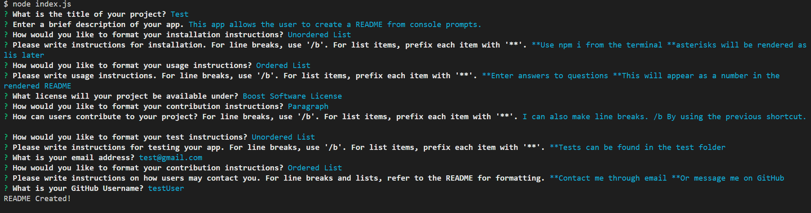

# README Generator
<!-- TODO: Link to video -->
[Link to Video](https://drive.google.com/file/d/1LfNaEChuBNXGg5FXJkbzujLNlP68xCkN/view)

[Sample README Created with APP](./sampleapp.md)

## Description
This app generates a README file based on user responses to prompts in the terminal. 

## Screenshot

## Installation
* Download the requisite files to your computer from GitHub.
* In the console, use the "npm i" command to install the required node modules. 

## Usage
* Open the app's folder in the terminal.
* Ensuring you're in the right folder, use the "node index.js" command to start the app. 
* A series of prompts will guide you through the creation of content for your README.
* The title of the project will also be the title of the README once generated.
* Certain sections of the README will ask what format you'd like the data to be in: paragraph, unordered list, or ordered list. Choose accordingly.
* In these sections, "/b" can be entered to create a line break. 
* Double asterisks ("**") can be used to create a list item for the previously chosen list type. Please do not put a space between the asterisks and the following text. (Ex: "\**First data point").
* Users may leave sections blank, and those section titles will not be printed to the README. 
* PLEASE NOTE: The Table of Contents will still reflect the omitted section, so you will have to manually delete it if you wish for it to be removed. This error will hopefully be fixed in a future update. 
* At the conclusion of the prompts, you'll be notified in the console if your README was successfully generated. 
* Your README will be located in the READ-ME-GENERATOR project folder under the title of your project. 
* Thanks for using my app!

## License
Please refer to the license in the repo.

- - -